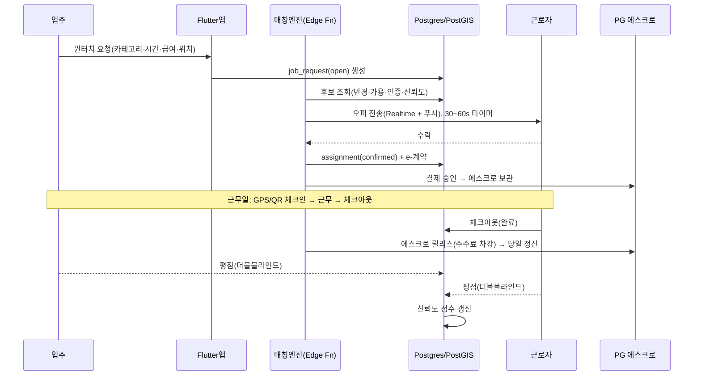
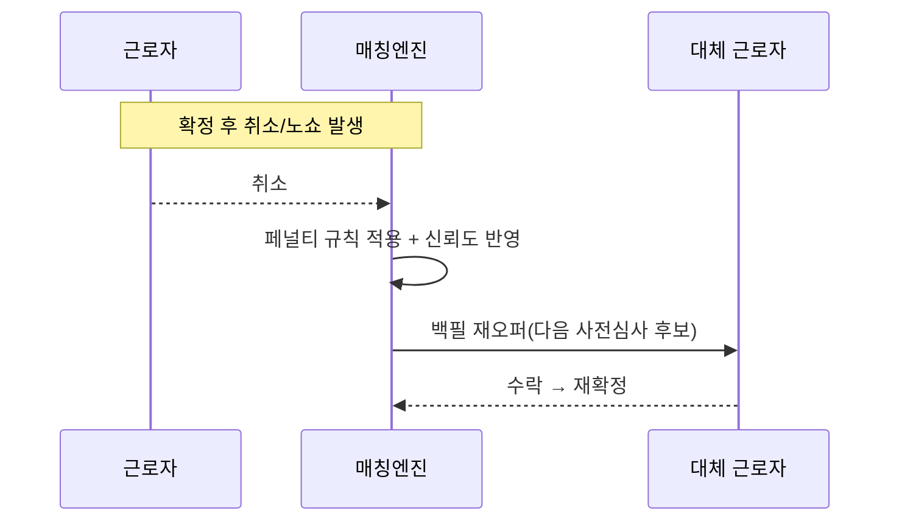

# 아키텍처 설계

## 1. 기술 스택 (확정)

| 레이어 | 선택 | 근거 |
|---|---|---|
| 모바일 앱 | **Flutter** (Dart), Android 우선 → iOS 후속 | AOT 컴파일로 빠른 콜드스타트, 지도·다수 마커·실시간 애니메이션 UI가 부드러움. "실행 속도·유저 편의성"이라는 핵심 요구에 최적. 단일 코드베이스. |
| 관리자/업주 웹 콘솔 | Next.js (후속) | 대량 채용 업주·운영팀용. MVP에서는 후순위. |
| 인증 | Supabase Auth (휴대폰 OTP) + **본인확인기관(PASS/PortOne 본인인증)** | 주민번호 원문 미보관. 계좌 소유확인은 PG로. |
| DB | **Supabase Postgres + PostGIS** | 거래의 원천 진실. 위치 매칭은 PostGIS(`ST_DWithin`, KNN `<->`). |
| 실시간 | Supabase **Realtime**(Postgres CDC over WebSocket) + **FCM/APNs 푸시** | 포그라운드=실시간 채널, 백그라운드=푸시(사람이 언제 필요할지 모르므로 푸시가 필수 폴백). |
| 서버 로직 | Supabase **Edge Functions**(Deno/TS) | 매칭 오케스트레이션, 에스크로/PG 웹훅, 계약 발급, 알림. |
| 핫패스(후속) | 전용 매칭 워커(Deno/Go) + **Redis GEO/H3** | MVP는 PostGIS로 충분. 지연·규모가 요구하면 인메모리 지오 인덱스로 승격. |
| 결제/정산 | **라이선스 PG 에스크로**(PortOne 또는 토스페이먼츠) | 승인→에스크로 보관→완료 시 릴리스. 자금 우리 계좌 미보관(전금법). |
| 안심번호/알림 | 통신사 안심번호 또는 Twilio/Vonage, FCM/APNs | 전화번호 노출 차단, 인앱 로그 채팅(분쟁 증거). |
| 인프라 | Supabase(호스티드, ap-northeast-2 인접) + GitHub Actions CI | 데이터 레지던시·컴플라이언스 친화. |

> **주의(스택 재조정):** 리서치 종합안은 NestJS+Go 자체구축을 추천했으나, 사용자 결정(Supabase 매니지드)을 우선한다. **Supabase-first로 빠르게 MVP → 필요 지점만 커스텀 워커로 분리**하는 하이브리드 경로. 사용자 계좌에 자금이 머물지 않도록 정산은 반드시 라이선스 PG를 경유.

## 2. 시스템 구성도

```mermaid
flowchart TB
  subgraph Client["📱 Flutter 앱 (Android 우선)"]
    E[업주(요청자) 화면]
    W[근로자 화면]
  end

  subgraph Edge["Supabase Edge Functions (Deno/TS)"]
    M[매칭 오케스트레이터]
    C[e-계약 발급]
    P[결제/에스크로 웹훅]
    N[알림 디스패처]
  end

  subgraph Data["Supabase"]
    DB[(Postgres + PostGIS)]
    RT[[Realtime 채널]]
    ST[(Storage: 계약/사진)]
    AU[Auth]
  end

  subgraph Ext["외부 파트너"]
    PG[[라이선스 PG 에스크로]]
    ID[[본인확인기관]]
    FCM[[FCM / APNs]]
    SMS[[안심번호]]
  end

  E -- 요청 생성 --> DB
  DB -- CDC --> RT
  RT <-. 실시간 오퍼/위치 .-> W
  M -- 오퍼 푸시 --> FCM --> W
  W -- 수락 --> M --> C --> DB
  M --> P <--> PG
  AU <--> ID
  N --> SMS
```

## 3. 실시간 매칭 엔진 설계

### 3.1 매칭 파이프라인
```
요청 생성(open) 
  → 후보 풀 조회: 가용 AND 반경 내(PostGIS) AND 인증완료 AND 신뢰도≥임계 AND 시간충돌 없음
  → 랭킹 score = f(거리/ETA, 신뢰도, 수락예측확률, 급여적합)
  → 상위 후보에게 오퍼 전송(Realtime + 푸시), match_offer(expires_at ~30–60s) 생성
  → 수락 → assignment(confirmed) + e-계약 + 에스크로 승인 → 슬롯 잠금
  → 거절/만료 → 다음 후보로(백필 큐) → headcount 충족 또는 풀 소진까지 반복
```
- **시작은 "신뢰도 가중 최근접(greedy)"** + 하드 SLA(수 초 매칭 윈도우). 이후 롤링 이분매칭(Hungarian) 배치 패스로 업그레이드.
- **수락예측확률**(카카오T 패턴): 안 받을 사람에게 오퍼 낭비를 줄임.
- **ETA 2단계**: 지금은 직선거리/라우팅 API 근사 → 후속에 ML 잔차 보정.
- **오퍼 팬아웃 전략**: 단일 순차 vs 상위 N 웨이브 동시 오퍼. 초기엔 소규모 웨이브(예: 상위 3명, 먼저 수락 우선) + 나머지 백필 대기.

### 3.2 자동 백필 (핵심 약속)
취소/노쇼 이벤트 발생 → 해당 assignment를 `cancelled`로, 요청을 다시 매칭 큐에 투입 → 사전심사된 다음 후보에게 즉시 재오퍼. 이것이 "확정 or 우리가 다시 채움"의 실체.

### 3.3 정직한 SLA (트릴레마 방어)
초기엔 "X분 내 보장" 같은 하드 약속을 걸지 않는다. 대신:
- "평균 N분 내 확정, 못 채우면 **자동 백필**, 그래도 못 구하면 **수수료 0**" — 지킬 수 있는 약속.
- 강제 배차 없음, 거절 불이익 없음 → **중립 직업소개 포지션 유지 + 공정성 차별화**.

## 4. 신뢰 & 안전 시스템

| 시스템 | 설계 |
|---|---|
| **본인 인증** | 휴대폰 OTP(Supabase) + 본인확인기관 ID + 계좌 소유확인(PG) + (업주) 사업자등록 진위확인. 민감 카테고리는 추가 검증. **주민번호 원문 미보관·암호화**. |
| **신뢰도 점수** | 롤링 윈도우(수락률/완료율/노쇼율/평점). 접근·티어 게이팅. `reliability_events`로 이벤트 소싱. |
| **더블블라인드 평점** | 양측 모두 제출 시(또는 14일 후) **동시 공개**, 공개 즉시 잠금, **완료·정산된 건만** 리뷰 가능. 세부점수(시간준수/품질/소통). 보복·인플레 완화. |
| **대칭 노쇼/취소 페널티** | 시간대별 티어(유예창→25/50/100%→보증금 몰수), 양측 신뢰도 연동, 상대 귀책 시 자동 면제, **이의신청 경로**. "거절"과 "수락 후 취소"를 분리. |
| **에스크로** | PG가 보관, 완료 시 릴리스. 우리 계좌 미보관. |
| **안전** | 안심번호(전화 미노출), 신뢰 연락처에 실시간 위치 공유, 원터치 SOS, 인앱 로그 채팅(분쟁 증거). |
| **분쟁** | 에스크로 프리즈 + 48–72h 증거 SLA + 무응답 자동 규칙(근로자 무응답→환불, 요청자 무응답→릴리스). |

## 5. 핵심 시퀀스 — 요청부터 정산까지





## 6. 성능/실행속도 원칙 (핵심 요구)
- **콜드스타트 최소화**: 스플래시→첫 인터랙션 목표 < 1.5s. 지연 초기화, 필요한 데이터만 프리패치.
- **낙관적 UI**: 요청/수락 등은 즉시 반영 후 서버 확정. 실패 시 롤백.
- **지도 성능**: 마커 클러스터링, 뷰포트 밖 언로드, 위치 핑 스로틀링.
- **오프라인 내성**: 네트워크 끊김 시 큐잉·재시도, 상태 복원.
- **관측성**: 매칭 지연 p99, 충원율, 확정 후 노쇼율을 1급 지표로 계측.
