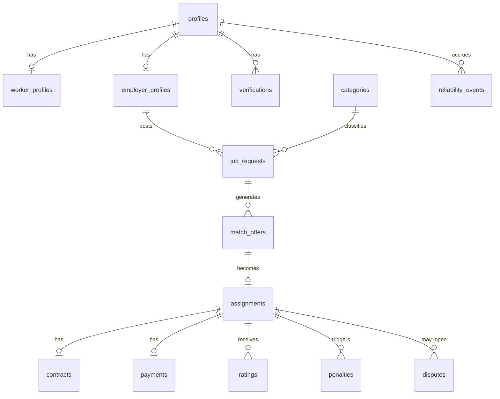

# 데이터 모델 (Postgres + PostGIS)

Supabase Postgres 기준. 위치는 `geography(Point,4326)`, 시간은 `timestamptz`. 모든 테이블은 RLS 활성화. 아래는 **MVP 핵심 서브셋**(후속 확장 여지 있음).

## 1. ER 개요



## 2. 열거형(enum)

```sql
create type user_role        as enum ('worker','employer','both','admin');
create type verify_type      as enum ('phone','identity','bank','business','background');
create type verify_status    as enum ('pending','verified','failed','expired');
create type request_status   as enum ('draft','open','matching','confirmed','in_progress','completed','cancelled','expired');
create type offer_status     as enum ('offered','accepted','declined','expired','cancelled');
create type assign_status    as enum ('confirmed','checked_in','completed','no_show','cancelled_worker','cancelled_employer');
create type pay_status        as enum ('authorized','escrowed','released','refunded','partial_refund','failed');
create type rating_dir       as enum ('worker_to_employer','employer_to_worker');
create type reliability_kind as enum ('completed','on_time','late','late_cancel','no_show','declined');
```

## 3. 핵심 테이블

```sql
-- 사용자 (Supabase auth.users 확장)
create table profiles (
  id            uuid primary key references auth.users(id),
  role          user_role not null default 'worker',
  display_name  text,
  phone         text,                 -- 인증된 번호
  phone_verified bool default false,
  status        text default 'active',-- active/suspended/banned
  created_at    timestamptz default now()
);

-- 근로자 프로필
create table worker_profiles (
  profile_id        uuid primary key references profiles(id) on delete cascade,
  bio               text,
  skills            text[] default '{}',
  home_geog         geography(Point,4326),
  current_geog      geography(Point,4326),      -- 최근 위치(가용 시)
  is_available      bool default false,
  last_seen_at      timestamptz,
  reliability_score numeric(4,1) default 50.0,  -- 0~100
  tier              text default 'standard',    -- standard/verified/top_pro
  identity_verified_at timestamptz,
  bank_verified_at     timestamptz
);
create index on worker_profiles using gist (current_geog);   -- 위치 매칭 핵심 인덱스
create index on worker_profiles (is_available, reliability_score);

-- 업주(요청자) 프로필
create table employer_profiles (
  profile_id      uuid primary key references profiles(id) on delete cascade,
  business_name   text,
  biz_reg_no      text,
  biz_verified    bool default false,
  default_geog    geography(Point,4326),
  default_address text
);

-- 인증 이력
create table verifications (
  id          uuid primary key default gen_random_uuid(),
  profile_id  uuid references profiles(id) on delete cascade,
  type        verify_type not null,
  status      verify_status not null default 'pending',
  provider    text,            -- PASS/PortOne/toss 등
  ref         text,            -- 외부 참조(원문 식별정보 미보관)
  verified_at timestamptz,
  created_at  timestamptz default now()
);

-- 카테고리(전방위 플랫폼: 버티컬 트리)
create table categories (
  id        uuid primary key default gen_random_uuid(),
  parent_id uuid references categories(id),
  slug      text unique not null,
  name      text not null,
  is_active bool default true
);

-- 일감/근무 요청
create table job_requests (
  id            uuid primary key default gen_random_uuid(),
  employer_id   uuid references employer_profiles(profile_id),
  category_id   uuid references categories(id),
  title         text not null,
  description   text,
  geog          geography(Point,4326) not null,
  address       text,
  start_at      timestamptz not null,
  end_at        timestamptz not null,
  headcount     int not null default 1,
  filled_count  int not null default 0,
  pay_type      text not null default 'daily',   -- daily(일급)/hourly(시급)
  pay_amount    int  not null,                    -- 원(₩), 총액 선공개
  status        request_status not null default 'open',
  auto_backfill bool default true,
  created_at    timestamptz default now()
);
create index on job_requests using gist (geog);
create index on job_requests (status, start_at);

-- 매칭 오퍼 (근로자에게 보낸 제안)
create table match_offers (
  id          uuid primary key default gen_random_uuid(),
  request_id  uuid references job_requests(id) on delete cascade,
  worker_id   uuid references worker_profiles(profile_id),
  rank        int,
  score       numeric,
  status      offer_status not null default 'offered',
  reason      jsonb,          -- 설명가능 랭킹: {distance, eta, reliability, ...}
  offered_at  timestamptz default now(),
  expires_at  timestamptz not null,
  responded_at timestamptz,
  unique (request_id, worker_id)
);
create index on match_offers (worker_id, status);

-- 확정 배정
create table assignments (
  id           uuid primary key default gen_random_uuid(),
  request_id   uuid references job_requests(id),
  worker_id    uuid references worker_profiles(profile_id),
  status       assign_status not null default 'confirmed',
  check_in_at  timestamptz,
  check_in_geog  geography(Point,4326),
  check_out_at timestamptz,
  confirmed_at timestamptz default now(),
  unique (request_id, worker_id)
);
create index on assignments (worker_id, status);

-- 전자 근로계약서
create table contracts (
  id            uuid primary key default gen_random_uuid(),
  assignment_id uuid references assignments(id) on delete cascade,
  pdf_url       text,             -- Supabase Storage
  terms         jsonb,            -- 급여·시간·업무·당사자(요청자=사용자)
  income_type   text default 'daily_wage', -- 일용근로소득 기본
  signed_worker_at   timestamptz,
  signed_employer_at timestamptz,
  created_at    timestamptz default now()
);

-- 결제/에스크로 (PG 경유, 자금 우리 계좌 미보관)
create table payments (
  id            uuid primary key default gen_random_uuid(),
  assignment_id uuid references assignments(id),
  pg_provider   text,           -- portone/toss
  pg_tx_id      text,
  amount        int not null,
  commission    int not null default 0,   -- 유료직업소개 요율 상한 준수
  status        pay_status not null default 'authorized',
  authorized_at timestamptz,
  escrowed_at   timestamptz,
  released_at   timestamptz
);

-- 평점 (더블블라인드)
create table ratings (
  id            uuid primary key default gen_random_uuid(),
  assignment_id uuid references assignments(id) on delete cascade,
  rater_id      uuid references profiles(id),
  ratee_id      uuid references profiles(id),
  direction     rating_dir not null,
  stars         int check (stars between 1 and 5),
  sub_scores    jsonb,          -- {punctuality, quality, communication}
  comment       text,
  submitted_at  timestamptz default now(),
  revealed_at   timestamptz,    -- 양측 제출 or 14일 후
  locked        bool default false,
  unique (assignment_id, direction)
);

-- 신뢰도 이벤트(소싱)
create table reliability_events (
  id            uuid primary key default gen_random_uuid(),
  profile_id    uuid references profiles(id),
  assignment_id uuid references assignments(id),
  kind          reliability_kind not null,
  weight        numeric default 1.0,
  occurred_at   timestamptz default now()
);
create index on reliability_events (profile_id, occurred_at);

-- 페널티 (대칭)
create table penalties (
  id            uuid primary key default gen_random_uuid(),
  profile_id    uuid references profiles(id),
  assignment_id uuid references assignments(id),
  kind          text,           -- late_cancel/no_show ...
  amount        int default 0,  -- 보증금 몰수 등
  reason        text,
  waived        bool default false,   -- 상대 귀책 자동 면제
  appeal_status text default 'none',  -- none/open/upheld/rejected
  created_at    timestamptz default now()
);

-- 분쟁
create table disputes (
  id            uuid primary key default gen_random_uuid(),
  assignment_id uuid references assignments(id),
  opened_by     uuid references profiles(id),
  status        text default 'open',   -- open/evidence/resolved
  evidence      jsonb,
  resolution    text,
  sla_deadline  timestamptz,
  created_at    timestamptz default now()
);

-- 동의(위치정보/개인정보)
create table consents (
  id          uuid primary key default gen_random_uuid(),
  profile_id  uuid references profiles(id),
  type        text,             -- location/privacy/marketing
  granted     bool,
  granted_at  timestamptz default now()
);

-- 푸시 토큰
create table push_tokens (
  id         uuid primary key default gen_random_uuid(),
  profile_id uuid references profiles(id) on delete cascade,
  platform   text,               -- android/ios
  token      text not null,
  updated_at timestamptz default now()
);
```

## 4. 후보 조회 쿼리 (매칭 핵심)

```sql
-- 요청 지점 반경 R미터 내 가용·인증·신뢰도 만족 근로자 상위 N
select w.profile_id,
       st_distance(w.current_geog, r.geog) as dist_m,
       w.reliability_score
from worker_profiles w
join job_requests r on r.id = $1
where w.is_available
  and w.identity_verified_at is not null
  and w.reliability_score >= $2
  and st_dwithin(w.current_geog, r.geog, $3)      -- 반경(m), GiST 인덱스 사용
  and not exists (                                 -- 시간 충돌 배제
    select 1 from assignments a
    join job_requests jr on jr.id = a.request_id
    where a.worker_id = w.profile_id
      and a.status in ('confirmed','checked_in')
      and tstzrange(jr.start_at, jr.end_at) && tstzrange(r.start_at, r.end_at)
  )
order by w.current_geog <-> r.geog                 -- KNN 최근접
limit $4;
-- 애플리케이션에서 score = f(dist, reliability, accept_prob, pay_fit) 로 재랭킹
```

## 5. RLS 원칙
- 근로자는 자기 프로필/오퍼/배정만, 업주는 자기 요청/그에 딸린 배정만 조회.
- 상대 평점은 **공개(revealed) 전 비가시** → 더블블라인드 보장(뷰/정책으로 강제).
- 위치(`current_geog`)는 가용·매칭 컨텍스트에서만 노출, 정밀 좌표는 짧은 보존.
- 민감 인증정보(주민번호 등)는 **원문 미저장**, 외부 참조 토큰만.
